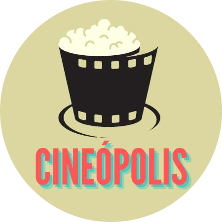

# MI_CC_UGR

Repositorio para almacenar las prácticas de CC del curso 22-23 del MUII en la UGR.

## Hito 0

- ⚙️ [Hito 0] Para visualizar la configuración de git y GitHub pulsa [aquí](doc/0_config_repo.md).
- 📔 [Hito 0] Para visualizar la descripción del proyecto pulsa [aquí](doc/0_descripcion_proyecto.md).
- 🪪 [Hito 0] La licencia que se va a usar en este proyecto es la GNU que puede leerse [aquí](LICENSE)

## Hito 1

- 📃 [Hito 1] Para leer la justificación del lenguaje, framework y arquitectura que se va a usar en el proyecto pulse [aquí](doc/1_justif_lenguaje.md).
- 💎 [Hito 1] Para conocer cómo se ha llevado a cabo la instalación inicial de la aplicación pulse [aquí](doc/1_instalacion.md).
- 📽️ [Hito 1] Para saber acerca de modelos de datos de la aplicación, pulse [aquí](/doc/modelos.md).
- 👨🏽‍💻 [Hito 1] Para conocer qué se ha desarrollado en este hito pulse [aquí](/doc/1_que_se_ha_hecho.md)

## Hito 2

- 📃 [Hito 2] Para leer la documentación sobre **gestores de tareas** pulse [aquí](/doc/2_gestor_tareas.md).
- 📃 [Hito 2] Para leer la documentación sobre **marcos de trabajo para pruebas** pulse [aquí](/doc/2_test_framework.md).
- 📃 [Hito 2] Para leer la documentación sobre **bibliotecas de aserciones** pulse [aquí](/doc/2_test_assertion_library.md).
- 👨🏽‍💻 [Hito 2] Para conocer **qué se ha desarrollado** en este hito pulse [aquí](/doc/2_que_se_ha_hecho.md)

## Hito 3

- 📃 [Hito 3] Para leer la documentación sobre **justificación de contenedor base** pulse [aquí](/doc/3_justif_contenedor.md).
- 📃 [Hito 3] Para leer la documentación sobre **contenedores en DockerHub, GitHub Container Registry y otros** pulse [aquí](/doc/3_contenedores.md).
- 👨🏽‍💻 [Hito 3] Para conocer **qué se ha desarrollado** en este hito pulse [aquí](/doc/3_que_se_ha_hecho.md)

## Cineópolis

En Cineópolis es tu aplicación para consultar la cartelera cuando quieras ver una película.

## Desarrollo y evolución

### Milestones

Para conocer los hitos del desarrollo del proyecto pulse [aquí](https://github.com/VictorRubia/MI_CC_UGR/milestones).

### Issues e Historias de Usuario

Para conocer las historias de usuario e issues del proyecto pulse [aquí](https://github.com/VictorRubia/MI_CC_UGR/issues).

### API Endpoints

Para conocer las posibles peticiones que se pueden solicitar a la API desarrollada pulse [aquí](/doc/2_api_endpoints.md) (Hito 2) [aquí](/doc/3_api_endpoints.md) (Hito 3).