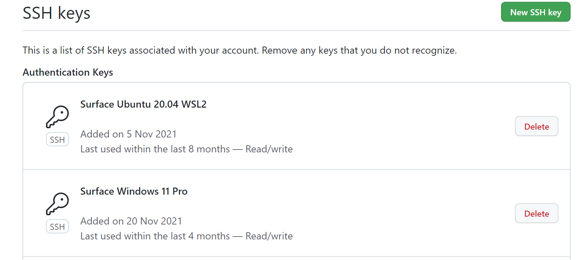

# Hito 0

## Configuración necesaria de Git y GitHub

### Autenticación en dos pasos para iniciar sesión en la cuenta

Se ha procedido a activar la autenticación en dos pasos, de modo que cuando se inicie sesión en un dispositivo nuevo, se solicite una doble confirmación de identidad. Gracias a esto, nuestra cuenta no podrá ser usurpada por ningún usuario, ya que previo a poder iniciar sesión nos llegará al correo o a la aplicación de GitHub una notificación para introducir un código de autenticación. En caso de que nosotros no hayamos sido los autores de este inicio de sesión, estamos prevenidos de que nuestra contraseña ha sido obtenida por alguien y debemos cambiarla cuanto antes.

Para conocer los pasos que se han realizado para llevar a cabo esta configuración pulsa [aquí](doc/../0_config_two_factor.md).

### Clave SSH para realizar funciones en el repositorio

Para poder manejar nuestro repositorio desde un entorno de escritorio, mediante git, es necesario que generemos una clave SSH única, que identifica nuestro dispositivo. De este modo, en los ajustes de nuestra cuenta de GitHub, podemos añadir nuestro dispositivo a una lista de dispositivos de confianza. Esta clave es una especie de "firma" que garantiza que somos quien decimos ser en los cambios que hagamos en GitHub. Además, activar esta funcionalidad tiene la ventaja de que git no nos pida nuestras claves de acceso constantemente a GitHub, aunque esto último se desactivó hace poco porque ya no se considera seguro este medio de acceso.

> Para realizarlo hemos clicado sobre el Perfil > Settings > SSH and GPG Keys y una vez aquí dentro se ha añadido nuestra clave pública sha-rsa.

En nuestro caso personal, esta opción ya la teníamos activada, lo cual se muestra en la siguiente imagen.

### Configuración y personalización del perfil de la cuenta

Para que se nos pueda identificar mejor dentro de la plataforma de GitHub, se ha procedido a establecer una imagen de perfil y a rellenar la hoja de datos personales, de modo que así también facilitemos el seguimiento por parte del profesor de mi proyecto.

