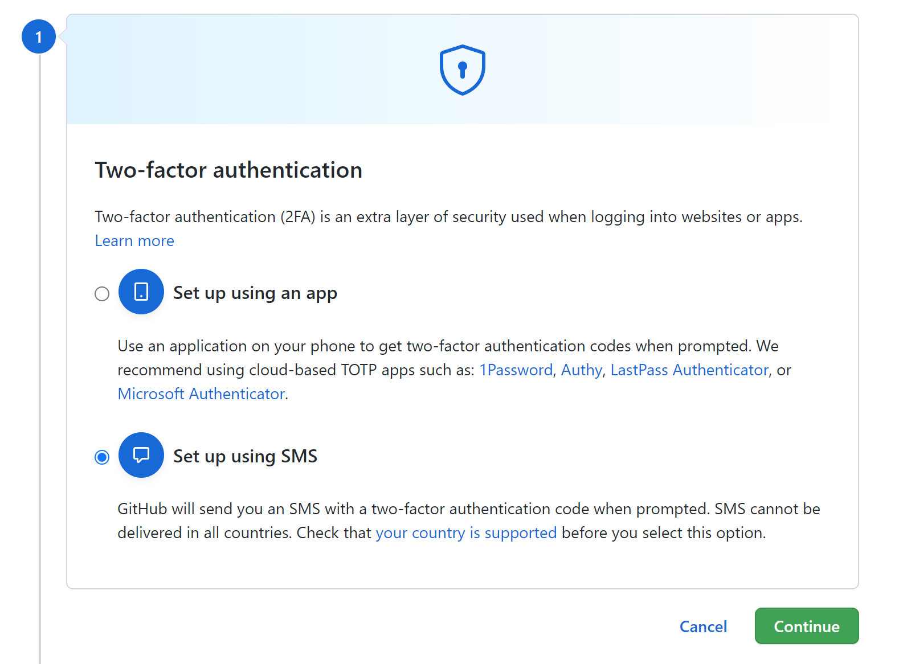

# Hito 0

## Configuración del segundo factor de autenticación

Para comenzar nos dirigimos a la configuración de nuestra cuenta.

Tras esto, nos dirigimos al apartado Password and Authentication y a la sección Two-factor authentication, donde pulsaremos sobre Enable two-factor authentication.

En nuestro caso, seleccionaremos la opción de usar un SMS para verificar.

Tras rellenar los datos necesarios, ya tendremos la función activada.

