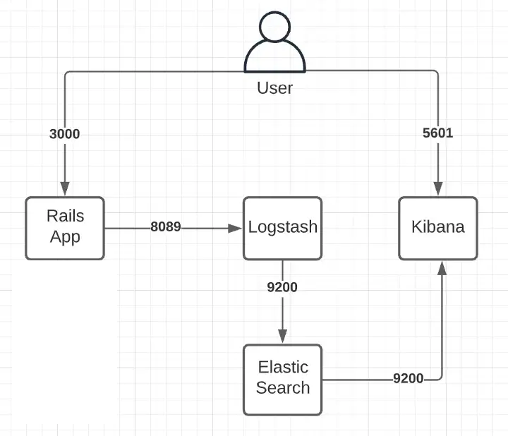
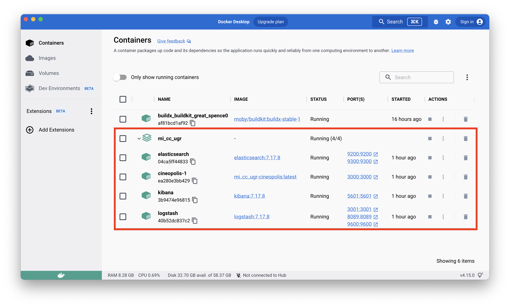
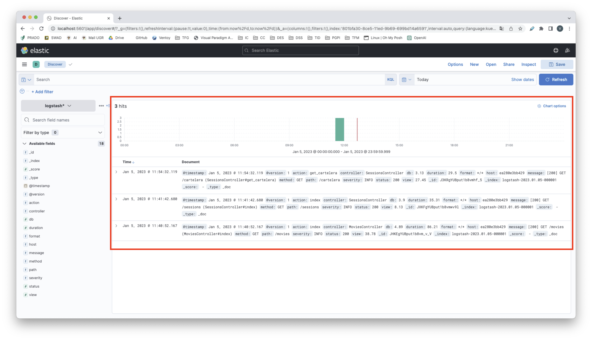

# Hito 5

## Configuración del logger

Como en nuestra aplicación estamos usando una imagen Docker que contiene lo necesario para ejecutar la aplicación Ruby On Rails de Cineópolis, lo que se ha hecho es buscar la forma de añadir un logger que se comunique con nuestro contenedor. Para eso se hace necesario primero investigar los métodos existentes y más utilizados. Tras realizar esta investigación, se opta por usar el Stack Elastic, que se compone de Elasticsearch, Logstash y Kibana.

### Elasticsearch

Elasticsearch es un motor de análisis y de búsqueda de textos que nos permite almacenar, buscar y analizar volúmenes grandes de datos de forma rápida y prácticamente en tiempo real. Está basado en la librería del motor de búsqueda de _Apache Lucene_, que nos provee un rendimiento muy bueno. Utiliza una estructura de datos llamada índice inverso, que está diseñada para permitir las busquedas de téxto de forma eficiente.

### Logstash

Logstash es una herramienta para la administración de logs y para la recopilación, análisis y almacenamiento de datos de diferentes fuentes para su posterior procesamiento. Es una aplicación de código abierto basada en jRuby que requiere de JVM para ejecutarse. Logstash tiene una gran variedad de salidas que permiten enrutar los datos a diferentes destinos, lo que hace que sea muy flexible usarlo.

### Kibana

Kibana es un framework de visualización para consultar y trabajar con los datos almacenados en Elasticsearch, proporcionando una interfaz de usuario de código abierto. Con Kibana podemos crear gráficos, tablas y mapas que nos ayudan a comprender mejor los datos para poder tomar decisiones. Tiene una interfaz de usuario amigable y es fácil para usuarios que se enfrentan a ella por primera vez.

Estos tres, forman el Stack Elastic (ELK) y se utiliza a menudo para el análisis de logs y visualización de los datos.

De forma esquemática, nuestra aplicación, con el Stack Elastic, se podría graficar de la siguiente forma:



Para comenzar, añadiremos las gemas necesarias a nuestro `Gemfile` para configurar el logger.

```
gem 'lograge'
gem 'logstash-event'
gem 'logstash-logger'
```

Para configurar dichas gemas añadiremos al `config/initializers` un archivo llamado `lograge.rb` que contenga las siguientes líneas de codigo:

```ruby
Rails.application.configure do
  config.lograge.enabled = true
  config.lograge.formatter = Lograge::Formatters::Logstash.new
  config.lograge.logger = LogStashLogger.new(type: :udp, host: ENV['LOGSTASH_HOST'], port: 8089)
end
```

### Docker

Tras esto ya podemos pasar a la parte de configuración en Docker. Como ya se mencionó anteriormente, nuestra aplicación ya se encontraba dentro de un contenedor Docker, la cual se explicó en el [hito 1](1_instalacion.md). Por esto, resulta necesario que a nuestro `docker-compose.yml` le añadamos el Stack Elastic. De esta forma, el archivo quedará de la siguiente forma:

```yaml
version: "3.9"
services:
  cineopolis:
    build: .
    command: bash -c "rm -f tmp/pids/server.pid && bundle exec rails s -p 3000 -b '0.0.0.0'"
    restart: always
    environment:
      - LOGSTASH_HOST=logstash
    volumes:
      - .:/CC
    ports:
      - "3000:3000"
    networks:
      - elknetwork

  elasticsearch:
    image: elasticsearch:7.17.8
    container_name: elasticsearch
    hostname: elasticsearch
    environment:
      - "discovery.type=single-node"
    ports:
      - 9200:9200
      - 9300:9300
    networks:
      - elknetwork

  logstash:
    image: logstash:7.17.8
    container_name: logstash
    hostname: logstash
    ports:
      - 9600:9600
      - 8089:8089
      - 3001:3001
    volumes:
      - ./logstash:/usr/share/logstash/pipeline/
    links:
      - elasticsearch:elasticsearch
    depends_on:
      - elasticsearch
    networks:
      - elknetwork

  kibana:
    image: kibana:7.17.8
    container_name: kibana
    hostname: kibana
    ports:
      - 5601:5601
    links:
      - elasticsearch:elasticsearch
    depends_on:
      - elasticsearch
    networks:
      - elknetwork

networks:
  elknetwork:
    driver: bridge
```

Para configurar adecuadamente Logstash, debemos crear una nueva carpeta en la raíz de nuestra aplicación llamada `logstash`. Dentro de ella, creamos un archivo de configuración `logstash.conf` que incluye las siguientes líneas de código:

```logstash
input {
   udp {
    host => "0.0.0.0"
    port => 8089
    codec => json_lines
  }
}

filter {
  json {
    source => "short_message"
    remove_field => "short_message"
  }
}

output {
  elasticsearch { hosts => ["elasticsearch:9200"] }
}
```

Tras esto, podemos hacer `docker compose up`, para comprobar cómo se construye correctamente la composición de contenedores:



### Visualización final de los logs

Para comprobar que funciona correctamente lo que se ha implementado, se prueban varias peticiones a nuestra api:

```
[200] GET /movies (MoviesController#index)
[200] GET /sessions (SessionsController#index)
[200] GET /cartelera (SessionsController#get_cartelera)
```

Si se ha configurado correctamente deberíamos poder visualizarlo en Kibana. Lo comprobamos:



Efectivamente vemos cómo se han registrado los logs y podemos ver las diferentes etiquetas que nos clasifican cada una de las peticiones. Esta herramienta nos permitirá filtrarlos y comprender de forma más exhaustiva lo que está sucediendo mientras se ejecuta nuestra aplicación en el Cloud.