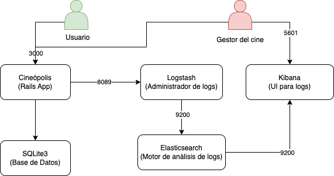

# Hito 6

## Documentación del fichero de composición

A continuación se expone el archivo `docker-compose.yml` que compone la aplicación y se documenta línea por línea qué hace cada una.

```yaml
# docker-compose.yml
# Versión 3.9 de docker-compose para poder compatibilizarlo 
# con la versión actual de docker engine en los contenedores de la aplicación
version: "3.9"
# Servicios que componen el clúster
services:
    # Servicio de la aplicación RoR que provee la API
  cineopolis:
    # Indicamos que construya el contenedor a partir del Dockerfile del directorio actual
    build: .
    # Indicamos que se ejecute el comando
    # bash -c "rm -f tmp/pids/server.pid && bundle exec rails s -p 3000 -b '
    # al iniciar el contenedor
    command: bash -c "rm -f tmp/pids/server.pid && bundle exec rails s -p 3000 -b '0.0.0.0'"
    # Indicamos que si falla el contenedor, se reinicie
    restart: always
    # Establecemos un nombre al contenedor
    container_name: cineopolis-api
    # Establecemos una variable de entorno para los logs
    environment:
      - LOGSTASH_HOST=logstash
    # Establecemos un volumen para la persistencia de los archivos
    volumes:
      - .:/CC
    # Establecemos que el contenedor estará expuesto en el puerto 3000
    ports:
      - "3000:3000"
    # Creamos una red interna entre los contenedores para los logs
    networks:
      - elknetwork
  # Servicio de la base de datos SQLite3
  db:
    platform: linux/amd64
    # Indicamos que utilice la imagen de SQLite3 de DockerHub
    image: nouchka/sqlite3:latest
    # Establecemos un nombre al contenedor
    container_name: sqlite3
    # Establecemos un volumen para que pueda proveer la BD que se usa en la API
    volumes:
      - ./db:/root/db
    # Para permitir que abramos stdin en el contenedor. Necesario para poder ejecutar comandos en el contenedor.
    stdin_open: true
    # 'Teletype' para permitirnos conectar un terminal al contenedor y ejecutar comandos en él.
    tty: true

  # Servicio del motor de búsqueda y análisis de logs
  elasticsearch:
    # Imagen de elasticsearch de DockerHub
    image: elasticsearch:7.17.8
    # Establecemos un nombre al contenedor
    container_name: elasticsearch
    # Establecemos un nombre de host para identificar al contenedor dentro de la red creada
    hostname: elasticsearch
    # Establecemos una variable de entorno necesaria para elasticsearch
    environment:
      - "discovery.type=single-node"
    # Establecemos que el contenedor estará expuesto en el puerto 9200 y 9300.
    ports:
      - 9200:9200
      - 9300:9300
    # Creamos una red interna entre los contenedores para los logs
    networks:
      - elknetwork
  # Servicio de la herramienta para la administración de logs
  logstash:
    # Imagen de logstash de DockerHub
    image: logstash:7.17.8
    # Establecemos un nombre al contenedor
    container_name: logstash
    # Establecemos un nombre de host para identificar al contenedor dentro de la red creada
    hostname: logstash
    # Establecemos que el contenedor estará expuesto en el peurto 9600, 8089 y 3001.
    ports:
      - 9600:9600
      - 8089:8089
      - 3001:3001
    # Establecemos un volumen para la persistencia de los logs
    volumes:
      - ./logstash:/usr/share/logstash/pipeline/
    # Creamos un enlace con el contenedor de elasticsearch
    links:
      - elasticsearch:elasticsearch
    # Establecemos una dependencia con el contenedor de elasticsearch
    depends_on:
      - elasticsearch
    # Creamos una red interna entre los contenedores para los logs
    networks:
      - elknetwork
  # Servicio que provee una interfaz web para la visualización de los logs
  kibana:
    # Imagen de kibana de DockerHub
    image: kibana:7.17.8
    # Establecemos un nombre al contenedor
    container_name: kibana
    # Establecemos un nombre de host para identificar al contenedor dentro de la red creada
    hostname: kibana
    # Establecemos que el contenedor estará expuesto en el puerto 5601
    ports:
      - 5601:5601
    # Creamos un enlace con el contenedor de elasticsearch
    links:
      - elasticsearch:elasticsearch
    # Establecemos una dependencia con el contenedor de elasticsearch
    depends_on:
      - elasticsearch
    # Creamos una red interna entre los contenedores para los logs
    networks:
      - elknetwork

# Creamos una red interna entre los contenedores para los logs
networks:
  elknetwork:
    # Establecemos el driver de la red en modo puente
    driver: bridge
```

## Diagrama de la composición

