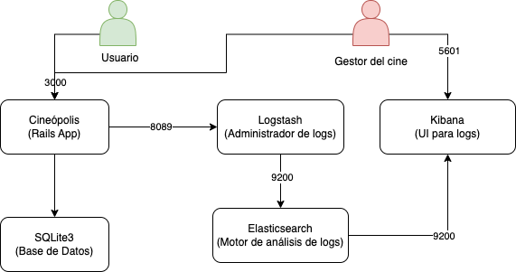

# Hito 6

## Justificación de la estructura del clúster

Para la realización de los objetivos de este hito debemos definir una estructura sobre la cual tendremos los nodos que formarán nuestra aplicación. Nuestra estructura contiene, por un lado, el contenedor con la lógica de la aplicación, por otro lado un contenedor para el gestor de bases de datos, en nuestro caso SQLite3 y, por otro lado, los contenedores correspondientes al Stack Elastic.
Respecto a la estructura que se tenía en hitos anteriores, se ha añadido un nuevo contenedor con SQLite3 para poder realizar
transacciones con la base de datos desde el CLI que incorpora SQLite3.

## Esquema del clúster

