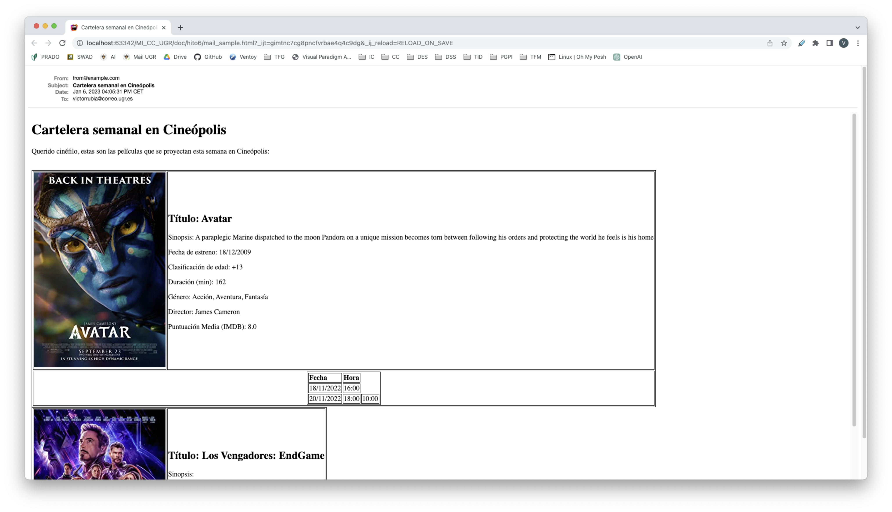

# Hito 6

## Desarrollo de las tareas



Para terminar el desarrollo de la aplicación se han llevado a cabo las tareas asociadas al hito 6, que tienen que ver con el envío de correos electrónicos con la cartelera de la semana a aquellos que proporcionen su correo electrónico.

Para lograrlo debemos primero pensar en una estructura de datos que nos permita almacenar aquellas personas que quieran recibir la cartelera semanal. Para ello, se creará un modelo nuevo, llamado newsletter, que contendrá correos electrónicos a los que enviarles la cartelera.

Además de esto, debemos configurar el Mailer de Rails para establecer el envío de correos electrónicos semanalmente a todos los coreros que están en nuestros registros.

Con esto, debemos crear también una estructura, en la parte de vista, para el correo electrónico, de modo que tenga un formato legible para los suscriptores.

A continuación, se detalla cada proceso.

## 1º. Creación del modelo newsletter

Se ha creado un nuevo modelo llamado newsletter cuya definición puede leerse pulsando [aquí](6_justif_modelo_newsletter.md). Con este modelo podemos tener un registro de los correos de aquellos usuarios que quieren recibir la cartelera semanal.

Esto genera una serie de End-Points nuevos en nuestra API, los cuales pueden ser consultados pulsando [aquí](6_api_endpoints.md):

- **GET /newsletters** -> Devuelve todos los correos electrónicos suscritos al sistema de envío de la cartelera semanal.
- **POST /newsletters** -> Añade un nuevo correo electrónico a la lista de suscriptores.

## 2º. Configuración del Mailer

Crearemos un mailer nuevo, llamado newsletter_mailer, que será el encargado de enviar los correos electrónicos a los suscriptores. Este tiene un método el cual se ejecuta para enviar el correo electrónico:
    
```ruby
  def newsletter_mailer
    # se obtienen todos los emails registrados para el envío de la cartelera
    @newsletter = Newsletter.all
    # se obtiene el día de comienzo de la semana
    start_date = (Time.now).beginning_of_week.strftime('%d/%m/%Y')
    # se obtiene el día final de la semana
    end_date = (Time.now).end_of_week.strftime('%d/%m/%Y')
    # obtenemos las sesiones para los dias que comprenden dicha semana
    @sessions = Session.where('dates BETWEEN ? AND ?', start_date, end_date)
    # obtenemos los correos formateados para pasarselos al mailer
    emails = @newsletter.collect(&:email).join(', ')
    # obtenemos las películas de las sesiones
    @movies = @sessions.map(&:movie).uniq
    
    # se envía el correo a los suscriptores
    mail to: emails, subject: 'Cartelera semanal en Cineópolis'
  end
```

## 3º. Creación de la vista del correo electrónico

Para crear la vista del correo electrónico, se ha creado un archivo llamado newsletter_mailer.html.erb en la carpeta app/views/newsletter_mailer. Este archivo contiene el código HTML que se enviará a los suscriptores con la información de la cartelera semanal.

El diseño de dicha vista se puede ver pulsando [aquí](/app/views/newsletter_mailer/newsletter_mailer.html.erb). Con este código ya listo, usaremos la gema `letter_opener` para probar el envío de correos sin necesidad de enviarlos directamente a los suscriptores y pudiéndo ver dicho resultado en el navegador.

Se configura en el **gestor de tareas** una tarea para ejecutar el envío de la cartelera semanal, dentro de `lib/tasks/`:

```ruby
desc 'weekly newsletter email'
task weekly_newsletter_email: :environment do
  NewsletterMailer.newsletter_mailer.deliver!
end
```

Pudiendo ejecutarlo con el comando `rake weekly_newsletter_email` y obteniendo de resultado el siguiente correo, dicho código HTML puede comprobarse pulsando [aquí](hito6/mail_sample.html):


## 4º. Configuración de Cron

Para que esta tarea se ejecute de forma semanal, añadiremos una gema nueva al proyecto llamada `whenever` que generará nuestro cron por nosotros. Para ello, ejecutaremos el comando `wheneverize .` y se creará un archivo llamado `schedule.rb` en la carpeta `config/` al cual debemos añadir lo que deseamos ejecutar:

```ruby
every :monday, at: '9am' do
  rake 'weekly_newsletter_email'
end
```

Donde cada lunes a las 9, se ejecutará la tarea de envío de cartelera semanal.

## 5º. Testeo de la funcionalidad desarrollada

Se han creado nuevos tests para la funcionalidad desarrollada, los cuales prueban que el envío de correos se realiza correctamente y que el modelo que registra a los usuarios en el envío de la cartelera semanal funciona correctamente:

```
$ make test
Running 25 tests in a single process (parallelization threshold is 50)
Run options: --seed 41413

# Running:

.........................

Finished in 0.156963s, 159.2732 runs/s, 229.3534 assertions/s.
25 runs, 36 assertions, 0 failures, 0 errors, 0 skips
```

## 5º. Despliegue en Heroku

[](https://github.com/VictorRubia/MI_CC_UGR/actions/workflows/heroku.yml)

Para concluir con el desarrollo, se desplegará el proyecto en Heroku. Para ello, se ha creado una nueva aplicación en Heroku, llamada cineopolis. Tras esto, configuramos un Action de GitHub para que cada vez que se haga un push, que modifique la lógica de la aplicación, en la rama master, se despliegue en Heroku.

Se puede ver el despliegue en Heroku pulsando [aquí](https://cineopolis.herokuapp.com/).

El GitHub Action puede verse [aquí](/.github/workflows/heroku.yml).